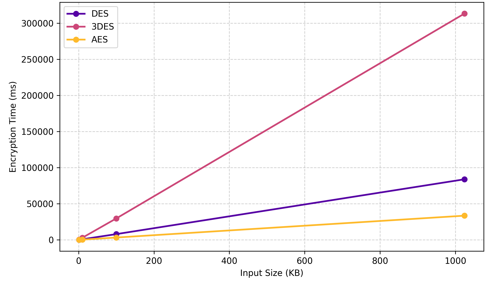
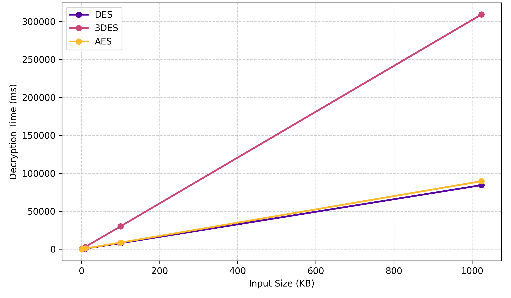

# Data Encryption From Scratch

Hi! I am Aigerim, and this project is my ECE 6357 final project demo for trying DES, 3DES, and AES encryption/decryption algorithms.

The website lets a user choose an algorithm, choose encrypt or decrypt, enter text or ciphertext, enter the required key(s), and see how much time the operation took.

## Project Structure

```text
data-encryption-from-scratch/
|-- README.md
|-- requirements.txt
|-- .gitignore
|-- src/
|   |-- des.py
|   |-- des_utils.py
|   |-- des_tables.py
|   |-- 3des.py
|   |-- aes.py
|   |-- aes_utils.py
|   `-- aes_tables.py
|-- docs (demo)/
|   |-- index.html
|   |-- style.css
|   `-- app.js
|-- tests/
|   `-- test.py
|-- examples/
|   `-- sample_run.ipynb
`-- results/
    |-- encryption_time_comparison.png
    `-- decryption_time_comparison.png
## Run Tests

```bash
pip install -r requirements.txt
pytest tests/test.py
```

## Run Python Examples

```bash
python src/des.py
python src/aes.py
python src/3des.py
```


## Benchmark Results

The project also includes benchmarking experiments for DES, 3DES, and AES. The algorithms were tested using different input sizes, and the execution time was measured for both encryption and decryption.

### Encryption Time Comparison

The encryption time results show that AES achieved the lowest encryption time, while 3DES required the highest time because it applies DES three times for each block.



### Decryption Time Comparison

The decryption time results show that 3DES also had the highest decryption cost. DES and AES had lower decryption times, with DES being slightly faster in decryption because of its Feistel structure.




## Notes

- DES/3DES uses an 8-character key.
- AES uses a 16-character AES-128 key.
- Ciphertext is shown as hexadecimal text so it is easy to copy back into the decrypt operation.
